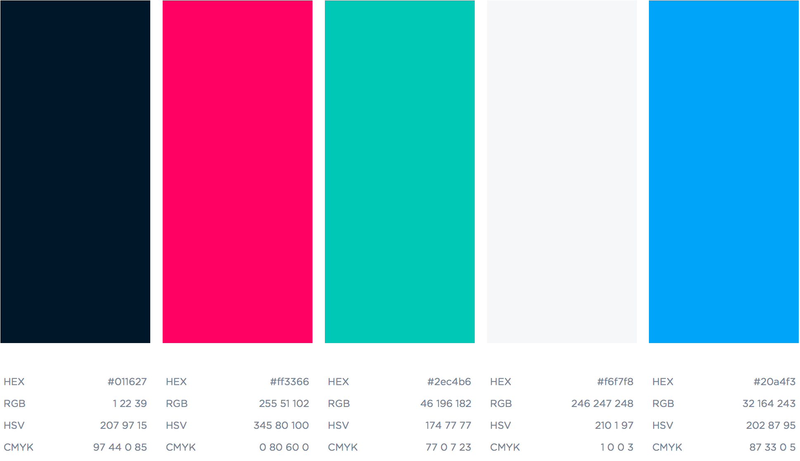

# graphic-chart of lowside.io

Visual projects will need to follow these guidelines.

<br />
<br />
<br />
<br />
<br />
<hr />

# Colors




BLACK
```
HEX    #011627
RGB    1 29 39
HSV    207 97 15
CMYK   97 44 0 85
```

RED

```
HEX    #ff3366
RGB    255 51 102
HSV    345 80 100
CMYK   0 80 60 0
```

GREEN

```
HEX    #2ec4b6
RGB    46 196 182
HSV    174 77 77
CMYK   77 0 7 23
```

WHITE

```
HEX    #f6f7f8
RGB    246 247 248
HSV    210 1 97
CMYK   1 0 0 3
```


BLUE

```
HEX    #20a4f3
RGB    32 164 243
HSV    202 87 95
CMYK   87 33 0 5
```
