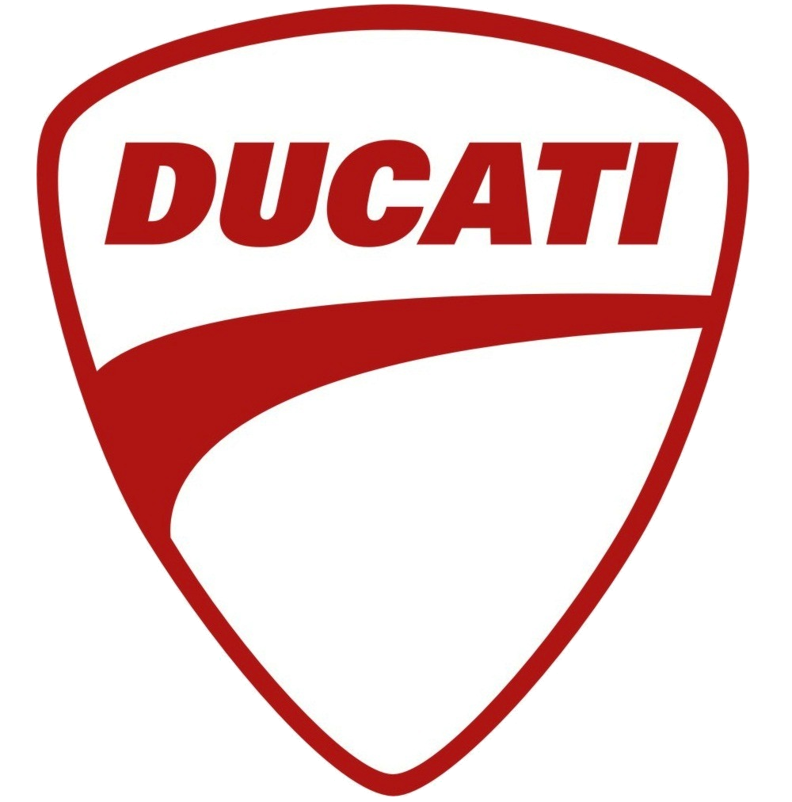

# brands info

Brands main color.

 
 
 
 
 

## Honda

main color: #FF0000
 

## Yamaha

 

red color (logo): #F30711

blue color: #1B3687

## Suzuki

 
red color: #E20A17

blue color: #003399

## Kawasaki

 

green color: #60BF19

## Harley-Davidson

 

orange color: #F6821F

black color: #000000

## BMW

 

blue color: #00A3DC

## KTM

 

orange color: #FF6600

## Triumph

 

black color: #000000

white color: #FFFFFF

## Aprilia

 

red color: #FE0000

## Ducati

 

red color: #AC0E0C

## Moto-Guzzi

 

black color: #000000

white color: #FFFFFF

## Kymco

 

black color: #EC1B23

white color: #0E0E0E

## Husqvarna

 

blue color: #133961

## Derbi

 

red color: #FB0200
grey: #9A9A9A

## GasGas

 

red color: #CA0002

## Hyosung

 

blue color: #005AAB

## Benelli

 

blue color: #FFFFFF

## MV Agusta

 

## Sherco

 

yellow color: #FFE01A

## Peugeot

 

blue color: #041D49

## Vespa

 

## Gilera

 

red color: #E0101D

## Piaggo

 

blue color: #0090D3

## ZERO ENGINEERING

 

green color: #204D34
